# 《灵农修仙》当前游戏逻辑流程图

> 依据当前工作树中的可执行代码整理，核心规则以 `scripts/autoload/game_state.gd` 为准；UI 文案和旧设计说明不作为运行逻辑依据。

最新的目标玩法方向另见 [`docs/TARGET-GAME-FLOW.md`](TARGET-GAME-FLOW.md)，当前代码与目标版之间的差距不要混入本图。

## 1. 总流程

```mermaid
flowchart TD
    A[启动 Godot 项目] --> B[加载 main.tscn]
    B --> C[GameState._ready 初始化新局默认状态]
    C --> D[main._ready 调用 SaveManager.load_game]
    D --> E{存在 user://lingnong_save.json?}
    E -- 否 --> F[继续使用新局默认状态]
    E -- 是 --> G[读取 JSON 并恢复资源、灵田、突破材料、渡劫丹、天劫进度、境界、天赋、成就、熟练度、长期计数、事件和计时器]
    G --> H[按轮回/晋级/总收获计数结算离线天赋点与灵石差额]
    H --> I[写入离线领取账本]
    F --> J[构建 HUD 和 7 个标签页]
    I --> J
    J --> K[进入主循环]

    K --> L[每帧 main._process(delta)]
    L --> M[GameState.update_world(delta)]
    M --> N{已到大限?}
    N -- 是 --> O[生产、事件、自动化全部暂停]
    O --> P{玩家选择}
    P -- 商店买长生丹 --> Q[寿元 +30 年，解除大限]
    Q --> K
    P -- 轮回（随时/大限立即/天人五衰） --> R[轮回次数 +1，清空本轮经营状态，按本世里程碑×2+突破×1 发放转世奖励，保留天赋树、未用天赋点、累计修为、里程碑、熟练度、成就、宝箱强化、碎丹经验和雷劫淬体；等待三选一转世天赋]
    R --> K
    P -- 出售现有资源/购买商店物品 --> S[仍可执行的非生产操作]
    S --> O

    N -- 否 --> T[扣除寿元]
    T --> U{本帧寿元归零?}
    U -- 是 --> O
    U -- 否 --> TR{正在渡劫?}
    TR -- 是 --> TS[只结算天劫；暂停灵田、事件和自动修炼]
    TS --> AD
    TR -- 否 --> V[轮换季节、随机事件和噬金虫]
    V --> W{已解锁自动修炼?}
    W -- 是 --> X[按灵气浓度增加修为和灵气]
    W -- 否 --> Y[跳过自动修炼]
    X --> Z[成熟灵田自动收获并立即补种]
    Y --> Z
    Z --> AD[刷新面板和存档]
    AD --> K

    K -. 玩家点击任意面板 .-> AE[面板调用 GameState 明确方法]
    AE --> AF{校验通过?}
    AF -- 否 --> AG[返回失败反馈，不改状态]
    AG --> K
    AF -- 是 --> AH[修改统一运行状态]
    AH --> AI[state_changed]
    AI --> AI2[AchievementSystem.refresh：一次性解锁成就并增加成就点]
    AI2 --> AJ[所有面板和 HUD 刷新]
    AI2 --> AK[main 立即保存 JSON]
    AH -. 点击突破且材料齐备 .-> AL[按稳定/强行模式消耗材料并 roll 成功率；成功则设置 tribulation_active]
    AL --> AM[显示三劫雷劫：灵气/底蕴/气运三道检查与三类渡劫准备按钮]
    AM -. 三道检查全部通过 .-> AL2[realm_changed：境界、寿元、解锁和突破天赋点生效]
    AL2 --> AM2[显示突破提示]
    AJ --> K
    AK --> K
    AM --> K
    AM2 --> K

    K --> AN{累计运行 30 秒?}
    AN -- 是 --> AO[定时保存 JSON]
    AN -- 否 --> K
    AO --> K
```

## 2. 灵田、作物和资源循环

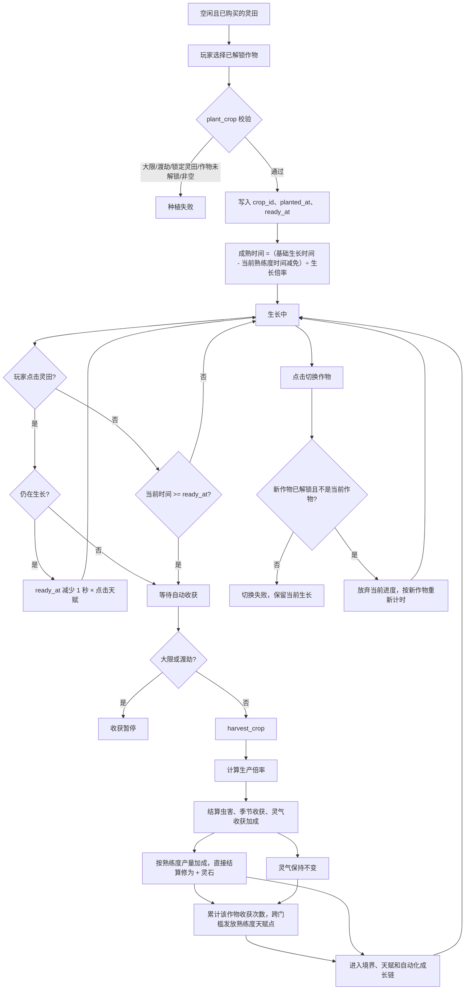

### 灵田生产计算

```text
生产倍率 = 境界生产倍率
         × 已解锁天赋生产倍率
         × 灵田档位倍率
         × 当前生产事件倍率
         × 狂暴丹 buff 倍率

作物数量 = max(1,
  floor(生产倍率 × 季节收获倍率 × 虫害因子 × 灵气收获倍率))
  + 当前熟练度产量加成

基础成熟时间 = max(0.001, 作物基础时间 - 当前熟练度成熟减免)

单轮修为 = 作物单株修为基值
         × 实际收获数量
         × 境界修炼倍率
         × 丹道/修为天赋倍率
         × 当前修炼事件倍率

单轮灵石 = 实际收获数量 × 作物灵石单价

单轮灵气 = 0
```

当前实际行为：作物成熟后只能由世界循环自动收获并补种；生长中的灵田提供【切换作物】按钮，切换会放弃当前进度并按新作物重新计时。

### 灵植熟练度

每种作物独立累计实际收获次数，进度跨大限和开始新局保留。产量和成熟时间取已达到的最高档位，天赋点在首次跨过门槛时累计：

| 门槛 | 聚灵草 | 凝神花 | 赤阳果 | 天道莲 |
|---:|---|---|---|---|
| 10 次 | 产量 +1，天赋 +1 | 同左 | 同左 | 同左 |
| 50 次 | 产量 +1、成熟 -1 秒、天赋 +2 | 产量 +1、成熟 -2 秒、天赋 +2 | 产量 +1、成熟 -5 秒、天赋 +2 | 产量 +1、成熟 -60 秒、天赋 +2 |
| 150 次 | 产量 +2、天赋 +3 | 同左 | 同左 | 同左 |
| 400 次 | 产量 +3、成熟 -1 秒、天赋 +5 | 产量 +3、成熟 -2 秒、天赋 +5 | 产量 +3、成熟 -5 秒、天赋 +5 | 产量 +3、成熟 -60 秒、天赋 +5 |

五种灵植共贡献 55 点熟练度天赋点。真实收获和模拟器都调用 `BalanceConfig.crop_proficiency_reward()` 与 `SimulationSystem.field_result()`，因此熟练度不会在两个模块中出现不同口径。

天赋点分为“可用点”和“累计获得点”两个账本：节点消费只减少可用点，累计获得点不减少。天劫九九/六九/三九档位按累计获得点判断，因此模拟器立即自动加点后，已解锁的天赋不会让天劫难度退回九九。

### 灵田购买和升档

| 操作 | 条件 | 消耗 | 结果 |
|---|---|---:|---|
| 购买第 2 块灵田 | 非大限、已有第 1 块 | 凡人基准 100；炼气/筑基/金丹为 300/800/2,000 | 已购槽位 +1 |
| 购买第 3 块灵田 | 非大限、已有第 2 块 | 凡人基准 500；炼气/筑基/金丹为 1,500/4,000/10,000 | 已购槽位 +1 |
| 凡田 → 灵田 | 炼气、非大限 | 4,000 灵石/块 | 该田产量档位 ×10 |
| 灵田 → 宝田 | 筑基、非大限 | 120,000 灵石/块 | 该田产量档位 ×100 |
| 宝田 → 仙田 | 金丹、非大限 | 3,000,000 灵石/块 | 该田产量档位 ×1,000 |

平衡口径：灵田是并行生产线，所以 1/2/3 块同档灵田的总产能是 `1× / 2× / 3×`；第三块相对前两块的边际提升是 `+50%`，不是再次翻倍。槽位价格随境界生产倍率同步缩放，保证第二块、第三块在四个境界的回本期不因境界跃迁而瞬间归零；农道核心天赋下第二块约 40~43 秒、第三块约 198~214 秒回本。升档按无农道约 120~180 秒、农道核心天赋约 45~90 秒回本，灵气库存、事件、狂暴丹和点击不纳入定价基线。

## 3. 修为循环

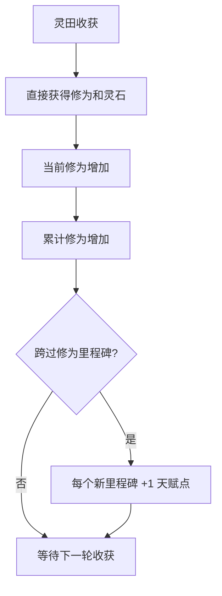

修为只从灵田收获和自动修炼进入，不再经过炼丹服用。突破材料不进入作物表，只能由商店兑换；炼气需要服气丹×10，筑基需要五种指定材料各 1，金丹需要六种指定材料各 1。生产 buff（狂暴丹）通过商店购买获得，见“商店资源转换”。

## 4. 境界、天赋和大限

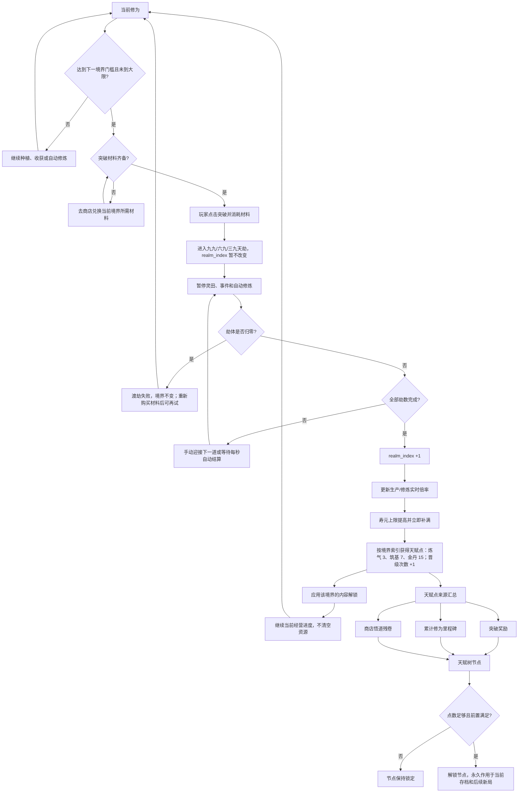

| 境界 | 突破所需当前修为 | 生产倍率 | 修炼倍率 | 寿元上限 | 突破天赋点 | 主要解锁 |
|---|---:|---:|---:|---:|---:|---|
| 凡人 | 0 | ×1 | ×1 | 80 年 | 0 | 聚灵草 |
| 炼气 | 1,000 | ×3 | ×3 | 120 年 | 3 | 灵雨诀、灵田升档至灵田 |
| 筑基 | 80,000 | ×8 | ×8 | 300 年 | 7 | 自动修炼、凝神花、庚金剑诀、守护灵阵 |
| 金丹 | 2,000,000 | ×20 | ×20 | 1,000 年 | 15 | 赤阳果、天道莲、灵田升档至仙田 |
| 元婴 | 100,000,000 | ×100 | ×100 | 3,000 年 | 31 | 紫芝、灵田升档至仙田 |

默认寿元衰减为 0.2 年/秒，所以五个境界从满寿元到大限的理论时长约为 400 / 600 / 1,500 / 5,000 / 15,000 秒。灵根天赋会进一步降低实际流逝速度。

### 突破成功率与三道雷劫检查

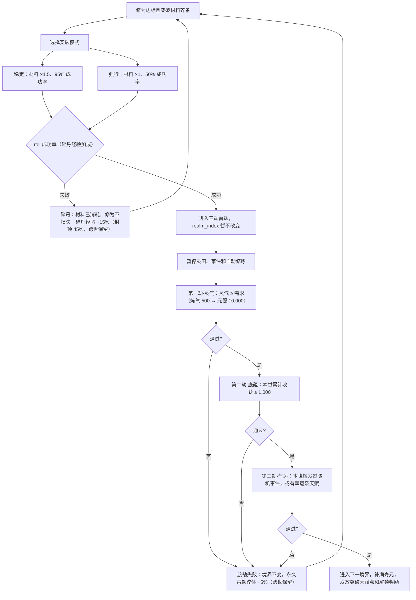

渡劫丹改为“渡劫准备”，每次渡劫各限 1 枚：治疗丹让第一劫灵气需求减半、抗性丹让第二劫底蕴需求减半、强化丹直接通过第三劫。玩家可以手动结算下一道检查，也可以等待每 5 秒自动结算；检查失败不损失修为，获得永久雷劫淬体（生产/修为 +5%，跨世保留）。

### 天赋树结构

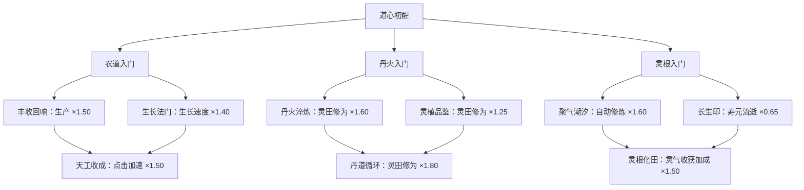

### 轮回与天人五衰

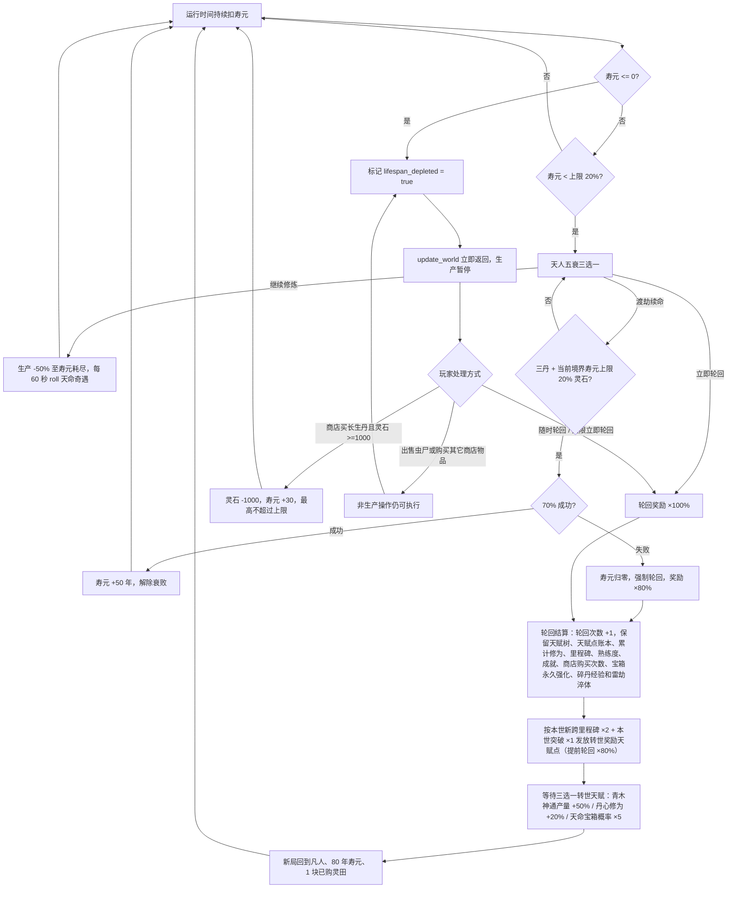

## 5. 季节、随机事件、噬金虫和法术

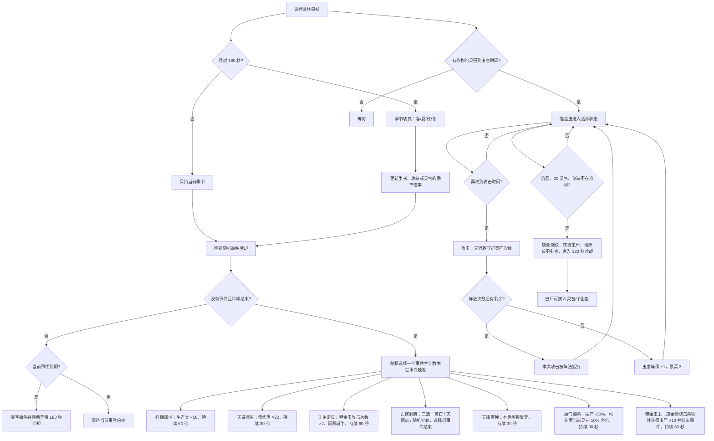

虫害计时口径：每轮开始时为每块灵田建立固定袭击计时；种下作物后若计时已到则立即进入预警，否则按原计时等待。首次基准为 30 秒预警、再过 30 秒首次攻击，之后每 30 秒攻击一次；兵主诞辰期间改为每 15 秒攻击、每次攻击次数 ×2。自动补种、手动种植和手动切换作物都不会重置该田的虫害状态和计时，只有开始新局才会重建计时。灵田卡片和事件面板会显示预警倒计时。

### 法术和阵法

| 操作 | 条件 | 状态变化 | 实际影响 |
|---|---|---|---|
| 灵雨诀 | 炼气解锁、10 灵气、目标灵田未生效 | 目标田 60 秒灵雨计时 | 后续种植的生长速度 ×8 |
| 庚金剑诀 | 筑基、20 灵气、目标田有活跃噬金虫、全局冷却结束 | 获得虫尸并重置该田虫害 | 清除噬金虫 |
| 升级守护灵阵 | 筑基、100 灵石 | 目标田阵法等级 +1，抵抗次数重置为 2+等级 | 减少后续虫害等级增长 |
| 出售虫尸 | 有虫尸 | 虫尸清零，灵石 +8/个 | 资源回流 |

## 6. 灵气、自动修炼和离线结算

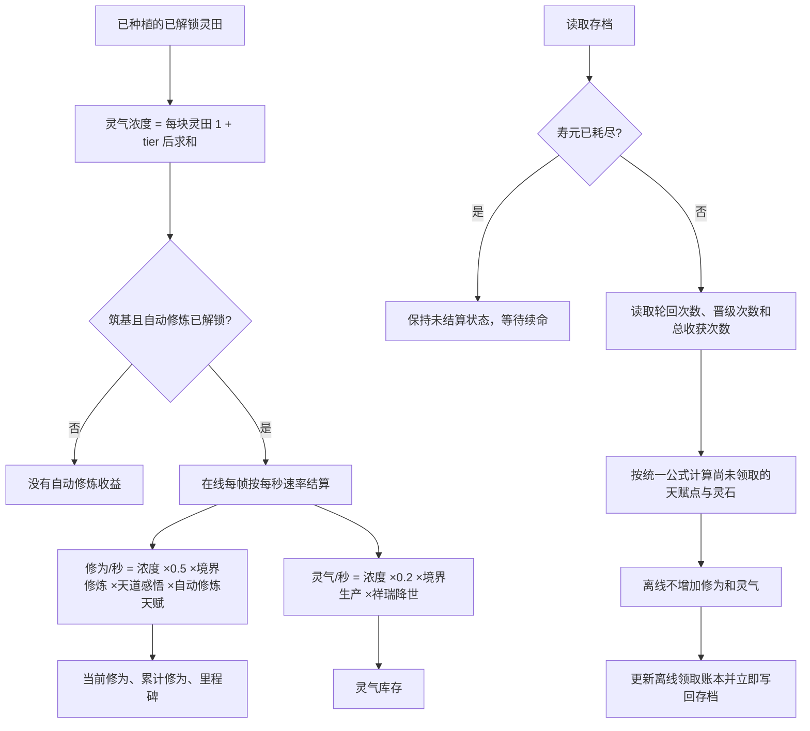

离线折算与离线时长无关：

```text
天赋点 = min(轮回次数, 3)
         + min(floor(晋级次数 / 2), 2)
         + min(floor(总收获次数 / 2000), 2)
灵石 = (轮回次数 × 50 + 晋级次数 × 100 + 总收获次数 × 2)
       × 当前境界生产倍率
```

天赋点总上限为 7；离线领取账本保证同一份长期计数不会重复领取。

灵气还会影响每次收获：每 100 点当前灵气提供 10% 收获加成，基础收获加成最高 ×3；灵根天赋可进一步放大这段加成。收获加成不会自动消耗灵气，灵雨诀和庚金剑诀会直接消耗灵气。

### 商店资源转换

| 商品 | 价格 | 效果 |
|---|---:|---|
| 长生丹 | 1,000 灵石 | 寿元 +30 年，不超过上限；大限时也能购买 |
| 聚气玉 | 1,000 灵石 | 灵气 +200 |
| 治疗丹 | 1,500 灵石 | 渡劫准备：第一劫·灵气需求减半 |
| 抗性丹 | 2,000 灵石 | 渡劫准备：第二劫·底蕴需求减半 |
| 强化丹 | 2,500 灵石 | 渡劫准备：第三劫·气运直接通过 |
| 悟道残卷 | 500 灵石 | 天赋点 +1 |
| 狂暴丹 | 100 灵石起，每次购买后 ×1.5 递进（四舍五入到 10，不设上限） | 生产 ×3，持续 5 秒；连买延长持续时间 |

狂暴丹的购买次数跨大限新局保留，新游戏重置；大限期间不能购买。价格按累计购买次数计算，越买越贵，是灵石的长线消耗出口。

### 成就

成就是独立的长期目标，不直接进入修为、灵石和天赋点主经济。当前定义集中在 `BalanceConfig.ACHIEVEMENTS`，由 `AchievementSystem` 在 `GameState.emit_state_changed()` 中统一检查，完成记录和成就点跨大限、跨新局保留。

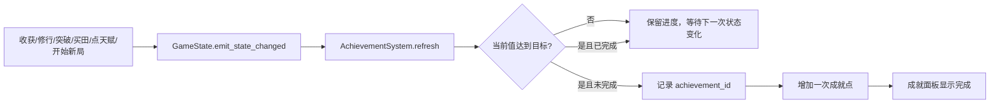

当前共 36 项：

| 类别 | 目标 |
|---|---|
| 灵田 | 收获 1 / 100 / 1,000 次；购买第 2 / 3 块灵田 |
| 修行与境界 | 累计获得 1,000 / 1,000,000 点修为；达到炼气 / 筑基 / 金丹 |
| 熟练度 | 四种作物各达到 10 次；聚灵草和天道莲各达到 400 次 |
| 轮回与天赋 | 开始第 1 / 3 次新局；解锁 5 个天赋节点 |

成就点只用于展示长期完成度；成就面板列出每项目标、当前值、类别和奖励点数。

## 7. UI、状态同步和存档

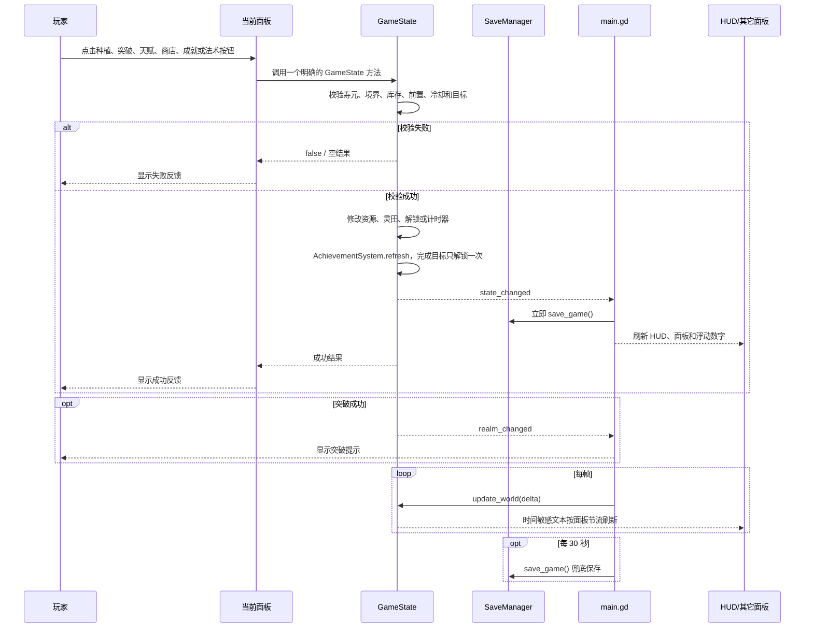

### 数值模拟面板的数据联动

数值模拟不是另起一套配置或独立结算器。`GameState` 暴露统一入口，面板和 headless 探针都调用同一个 `SimulationSystem`：

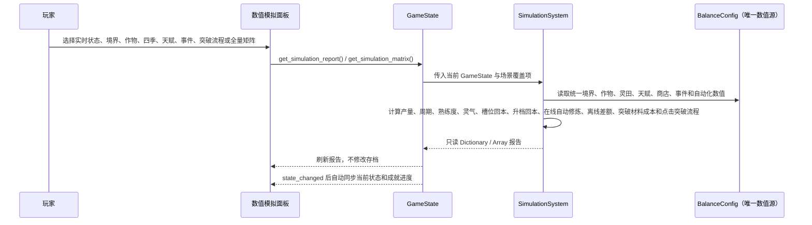

面板覆盖的情况：

- 实时状态：当前每块田的作物、档位、虫害和灵雨。
- 境界 × 灵田：凡人、炼气、筑基、金丹与 1/2/3 块田的总产能和槽位回本。
- 作物、四季、天赋、事件矩阵：使用 `BalanceConfig` 逐项比较。
- 熟练度矩阵：逐种作物比较 0 / 10 / 50 / 150 / 400 次档位。
- 境界总表：生产/修炼倍率、寿元、自动修炼和突破解锁。
- 突破流程：以点击频率、田数、档位和天赋路线为输入，按“种植 → 收获直接修为和灵石 → 校验商店材料 → 开始天劫 → 校验渡劫丹 → 完成天劫”计算阶段耗时，并拆出修炼时间和天劫时间；当前默认 4 次/秒，材料和丹药校验默认开启，关闭任一项时只输出明确标记的时间估算。
- 最大化突破流程：每次收获、里程碑或突破奖励到账后立即尝试解锁天赋节点；灵石先预留寿元、突破材料和渡劫丹，再购买能改变修为速率的聚气玉，模拟结果会列出自动购买和自动加点明细。
- 点击频率默认是玩家总点击数；面板也提供“每块灵田独立”模式，用于单独比较并行点击上限。
- 全量核心矩阵：境界 × 已解锁作物 × 四季 × 天赋路线 × 田数 × 可用档位。
- 可导出 `user://simulation_report.json`，用于记录当前参数下的完整结果。

成就面板：

- 展示 36 项成就的类别、说明、当前值、目标值、完成状态和成就点。
- 收获、修为、境界、灵田、熟练度、轮回和天赋节点变化后自动刷新。
- 成就点不参与生产、修炼、离线折算或天赋树消费；成就完成状态、累计获得天赋点、突破材料库存、渡劫丹库存、渡劫进度、幸运计数、宝箱永久强化、碎丹经验、雷劫淬体、转世天赋和天人五衰状态由 `SaveManager` 按存档版本 18 保存。

## 8. 当前运行状态的边界

### 每局会清空

- 灵石、灵气、当前修为。
- 虫尸；灵田收获直接结算灵石，不再经过出售步骤。
- 当前境界、已购买灵田槽位、灵田档位。
- 当前局突破材料库存；材料只能在商店兑换，突破时按所选模式消耗（稳定 ×1.5 / 强行 ×1）。
- 当前局治疗丹、抗性丹和强化丹库存；渡劫中途退出后继续保存当前检查进度和渡劫准备状态。
- 灵雨、阵法、虫害、随机事件、狂暴 buff、本轮解锁标志。
- 本世转世天赋、天降灵种解锁、本世收获与事件计数。

### 轮回会保留（跨世长期进度）

- 已点亮天赋节点。
- 未使用天赋点。
- 累计修为和已经领取到的里程碑位置。
- 每种灵植熟练度、晋级次数、轮回次数、总收获次数和离线领取账本。
- 成就完成状态和成就点。
- 宝箱永久强化（生产/暴击/寿元上限）、天命奇遇永久生产、碎丹经验和雷劫淬体。
- 商店购买次数（狂暴丹等越买越贵商品的价格依据）。

### 当前实现中没有

- 转世生产倍率；轮回奖励只按“本世新跨里程碑 ×2 + 本世突破 ×1 + 保留未用天赋点”发放天赋点，提前轮回 ×80%。
- 作物成熟后的手动收获按钮（成熟仍由世界循环自动收获）。
- 离线自动收获和离线噬金虫不单独结算；离线只按长期计数结算天赋点与灵石。

## 9. 代码对应关系

| 逻辑 | 主要文件 |
|---|---|
| 启动、每帧循环、面板组合、即时/定时存档 | `scripts/ui/main.gd` |
| 所有运行状态、资源结算、突破、大限、事件、法术 | `scripts/autoload/game_state.gd` |
| JSON 保存、读取、离线结算入口 | `scripts/autoload/save_manager.gd` |
| 唯一玩法数值源 | `scripts/systems/balance_config.gd` |
| 境界门槛和解锁奖励规则 | `scripts/systems/realm_config.gd` |
| 作物解锁查询 | `scripts/systems/crop_config.gd` |
| 灵气浓度和在线自动修炼规则 | `scripts/systems/automation.gd` |
| 生产/修炼倍率连乘 | `scripts/systems/multiplier_stack.gd` |
| 天赋节点、前置关系和效果汇总 | `scripts/systems/talent_tree.gd` |
| 商店商品和价格 | `scripts/systems/shop.gd` |
| 成就定义、进度和一次性解锁 | `scripts/systems/achievement.gd`、`scripts/systems/balance_config.gd` |
| 交互面板、数值模拟面板和 HUD | `scripts/ui/panels/*.gd` |
| 真实收获与游戏内模拟共用的计算层 | `scripts/systems/simulation.gd` |

## 10. 已完成的运行检查

```bash
/opt/homebrew/bin/godot --headless --path . --editor --quit
/opt/homebrew/bin/godot --headless --path . --quit-after 2
/opt/homebrew/bin/godot --headless --path . --scene res://scenes/probes/field_balance_probe.tscn
git diff --check
```

以上命令均已通过；探针同时覆盖 `BalanceConfig` 驱动的真实收获、游戏内模拟入口、境界/作物/四季/天赋/事件/全量矩阵、成就自动解锁、熟练度、离线折算、狂暴丹递进价格、稳定/强行突破与碎丹经验、三道雷劫检查、轮回与转世天赋、天人五衰三选一与天命奇遇、宝箱入账、新交互事件和 v18 存档往返。
