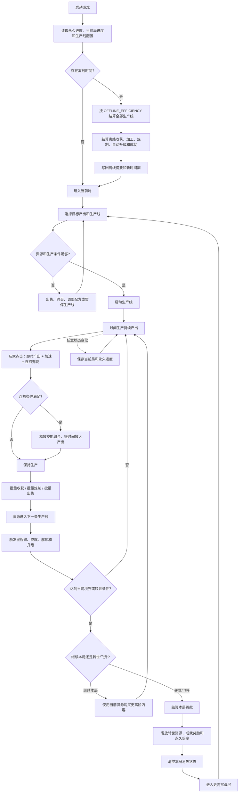
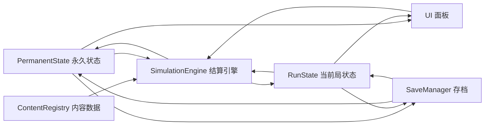
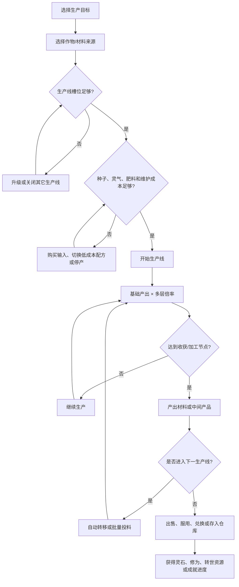
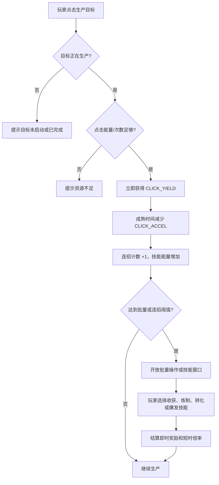
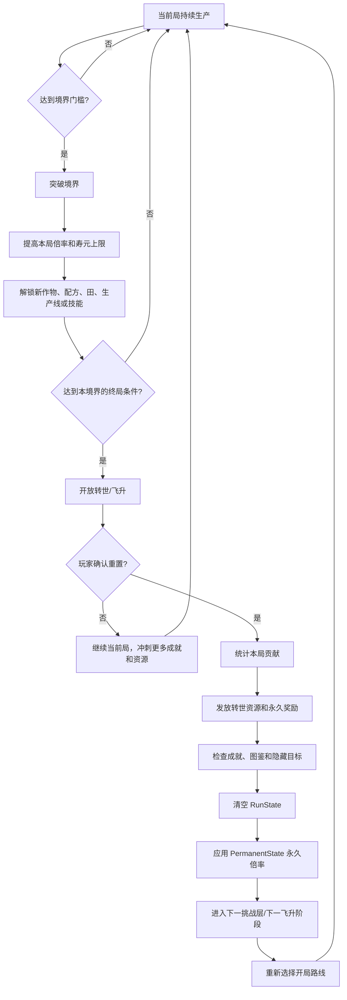
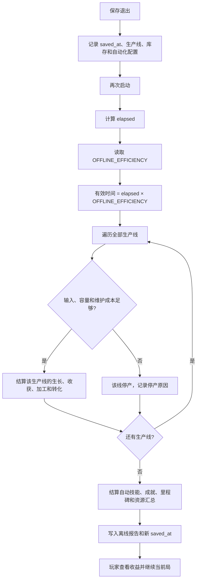
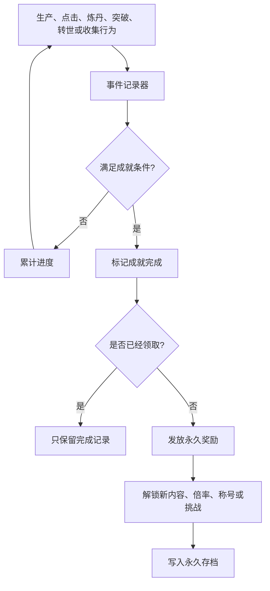
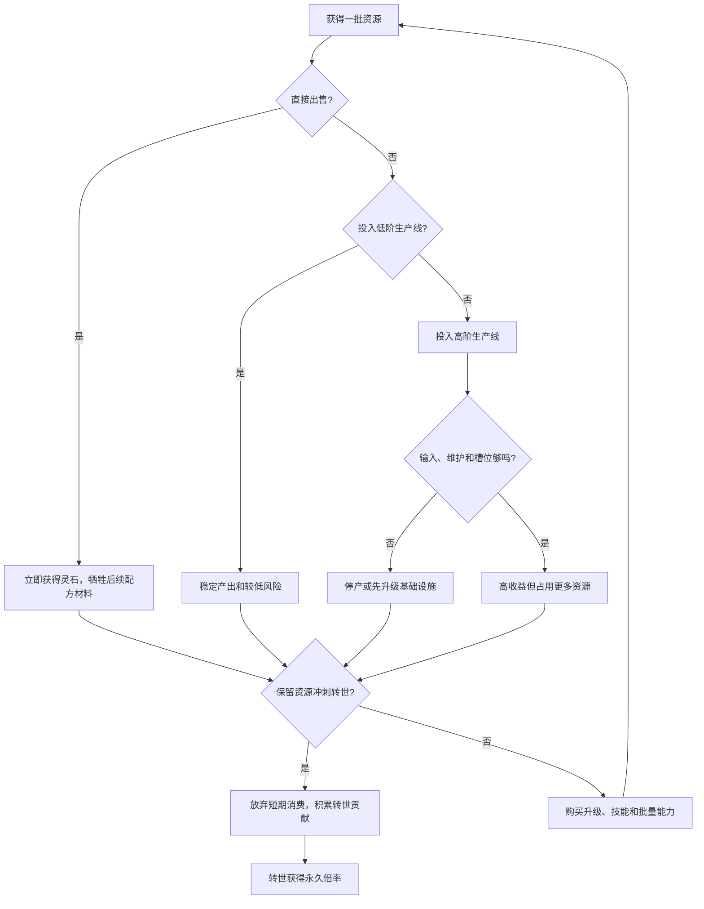

# 《灵农修仙》目标版增量玩法流程图

这份文档把最新提出的方向转成一套可落地的目标逻辑。它不是当前代码的描述，而是下一版玩法基线。

## 1. 目标结论

当前版本更像“教学型小循环”：内容少、倍率低、自动化比重高、重置成长已经被移除。目标版要改成：

```text
短循环：主动操作和生产线管理
中循环：配方、升级、技能和生产分支
长循环：转世/飞升、永久倍率、成就和更高境界
```

| 方向 | 目标版规则 |
|---|---|
| 内容规模 | 作物、丹药、材料、生产线、升级、技能和事件全部数据驱动，首期支持几十种，后续可扩展到上百种 |
| 指数增长 | 境界、转世、研究、灵田、生产线、套装、事件和技能分层相乘；转世次数直接推动永久倍率增长 |
| 主动操作 | 点击立即产生资源或充能，同时可以加速；支持批量收获、批量炼制和技能连招 |
| 重置成长 | 转世/飞升是核心循环；重置当前局资源，获得永久资源和永久倍率，再挑战更高境界 |
| 离线 | 不只结算自动修炼；按 `OFFLINE_EFFICIENCY` 结算所有已经配置的生产线，效率范围为 50%~100% |
| 成就目标 | 成就记录生产、突破、连招、收集和极限挑战，并提供永久奖励或新内容 |
| 成本决策 | 种子、材料、灵气、生产线槽位、批量操作和维护都有成本；玩家需要决定生产什么、何时停产、何时转世 |

## 2. 目标版总流程



## 3. 三层状态模型

目标版不能再把所有状态都堆在一个 `GameState` 里。要把“本局会清空的状态”和“转世后仍然保留的状态”拆开，避免重置逻辑继续变复杂。



### 3.1 当前局状态 `RunState`

- 当前境界、当前修为、当前寿元。
- 灵石、灵气、灵材、丹药和临时货币。
- 灵田槽位、灵田等级、种植中的作物和生产线库存。
- 当前生产线、当前配方、自动化开关和生产线维护状态。
- 临时 buff、事件、技能冷却、连招能量和本局成就进度。

### 3.2 永久状态 `PermanentState`

- 转世/飞升次数。
- 永久倍率、永久货币和永久研究点。
- 永久天赋树、研究树和解锁内容。
- 成就完成状态、收藏图鉴和最高境界记录。
- 已领取的永久里程碑奖励。

### 3.3 内容数据 `ContentRegistry`

所有内容都用数据表注册，不为每种作物或丹药单独写分支：

```text
Crops        作物、基础生长、基础产出、输入和解锁条件
Materials    中间材料、品质、出售价格和加工方式
Recipes      丹药/产品配方、输入、产出、品质和生产时间
Fields       灵田类型、槽位、容量、倍率和维护成本
Upgrades     升级节点、价格、前置和倍率
Skills       技能消耗、冷却、目标、连招标签和效果
Realms       境界门槛、倍率、内容解锁和转世条件
Achievements 成就条件、奖励、隐藏条件和展示文案
Events       事件触发、持续时间、倍率和特殊规则
```

## 4. 生产线主循环

目标版的核心不再是“种一种作物等成熟”，而是把多个生产步骤连接起来。



### 多层倍率

```text
总产出倍率 = 基础产出
           × 境界倍率
           × 转世永久倍率
           × 研究/天赋倍率
           × 灵田/生产线倍率
           × 升级倍率
           × 品质倍率
           × 事件倍率
           × 技能连招倍率
```

指数成长的关键不是把一个数字无限加大，而是让每一层都能被玩家理解和追踪：

```text
永久倍率 = PERMANENT_BASE ^ 转世次数
本局倍率 = 境界倍率 × 研究倍率 × 灵田倍率 × 生产线倍率
爆发倍率 = 事件倍率 × 技能连招倍率 × 品质倍率
最终倍率 = 永久倍率 × 本局倍率 × 爆发倍率
```

具体数值使用 `PERMANENT_BASE`、`ASCENSION_REWARD`、`CLICK_YIELD` 等配置项，不把数值散落在按钮回调中。

## 5. 主动操作和技能连招

### 5.1 点击行为



### 5.2 批量操作

批量操作必须有清晰的收益和成本，不再只是给单次按钮加一个循环：

| 操作 | 作用 | 代价/限制 |
|---|---|---|
| 批量收获 | 一次结算多个已成熟目标 | 消耗批量能量或受到冷却限制 |
| 批量炼制 | 一次处理多份配方 | 需要足够输入和炉容量 |
| 批量出售 | 快速清理库存 | 不能获得额外品质奖励 |
| 批量转化 | 将低阶材料换成高阶材料 | 损耗率或手续费随等级增加 |
| 一键补种 | 自动填充空闲生产线 | 需要种子库存和生产线预算 |

### 5.3 连招结构

具体技能可以继续使用现有技能，也可以扩展成标签化系统：

```text
生长技能 → 收获技能 → 加工技能 → 炼制技能 → 转世爆发技能

例：灵雨诀
  → 聚灵/加速
  → 批量收获
  → 批量炼丹
  → 狂暴/品质提升
  → 在事件结束前结算一轮高倍率产出
```

连招结算需要同时记录：

- 技能顺序是否正确。
- 两次技能之间的最大允许间隔。
- 消耗的灵气、能量和材料。
- 当前目标是否属于同一条生产线。
- 连招倍率、成就进度和失败反馈。

## 6. 境界、转世和飞升



### 重置时清空与保留

| 清空的本局状态 | 保留的永久状态 |
|---|---|
| 灵石、灵气、当前修为 | 转世/飞升次数 |
| 当前作物、灵材、丹药 | 永久倍率和永久货币 |
| 当前境界和灵田配置 | 研究树、天赋树和永久解锁 |
| 临时 buff、事件、技能冷却 | 成就、图鉴和最高记录 |
| 本局生产线和库存 | 已领取的里程碑奖励 |

转世奖励不只给一个数字，还要能改变下一局的开局选择：

```text
转世资源 → 永久倍率
          → 开局资源
          → 新生产线
          → 新技能槽
          → 新作物/丹药
          → 新成就分支
```

## 7. 离线结算



离线结算的规则：

1. 结算所有已开启的生产线，不只结算自动修炼。
2. 生长、收获、加工、炼制和资源转化使用与在线相同的公式。
3. 通过 `OFFLINE_EFFICIENCY` 降低产出效率，目标范围为 0.5~1.0。
4. 输入不足、库存满、生产线停用或维护成本不足时，该线停止，不凭空产出。
5. 离线期间不执行需要玩家选择目标的技能连招；自动技能只执行已经配置的安全策略。
6. 里程碑、成就和转世资源必须与在线结算走同一个奖励入口。

## 8. 成就、里程碑和留存目标



成就分为几类：

| 类型 | 示例目标 | 奖励方向 |
|---|---|---|
| 产量 | 单局收获 `TARGET_AMOUNT` | 永久生产倍率 |
| 主动 | 连续点击、批量收获或完成连招 | 点击收益、技能槽或能量上限 |
| 生产 | 完成指定配方链 | 新配方、生产线或加工倍率 |
| 境界 | 首次达到指定境界/飞升阶段 | 永久资源或开局加成 |
| 极限 | 在限定时间或低资源下完成目标 | 稀有天赋、称号或特殊内容 |
| 收集 | 解锁作物、丹药、品质和事件图鉴 | 收集倍率或新路线 |

## 9. 成本决策

目标版每条主要操作都要带来“现在收益”和“未来效率”的选择：



必须进入配置或状态的数据包括：

- 种植/生产输入成本。
- 生产线槽位和维护费用。
- 批量操作能量和冷却。
- 技能消耗、连招失败代价和爆发窗口。
- 高阶配方的库存容量与停产条件。
- 转世前保留比例和转世奖励公式。

## 10. 从当前版本迁移到目标版


建议的模块接口保持少而深：

```text
SimulationEngine.tick(delta, RunState, PermanentState, ContentRegistry)
SimulationEngine.apply_action(action, RunState, PermanentState, ContentRegistry)
SimulationEngine.simulate_offline(elapsed, snapshot, ContentRegistry)
AscensionEngine.preview(RunState, PermanentState, ContentRegistry)
AscensionEngine.commit(RunState, PermanentState, ContentRegistry)
AchievementEngine.record(event, PermanentState, ContentRegistry)
```

按钮只提交动作，不直接修改资源；在线、离线、测试和转世预览都经过同一套结算入口。

## 11. 目标版验收顺序

1. 一局内可以同时运行多条生产线，并且输入不足时会停产。
2. 点击能立即获得可见收益，不再只是减少一秒倒计时。
3. 批量收获、批量炼制和至少一条技能连招可以完整结算。
4. 境界突破能打开新的内容层，达到终局后可以主动转世/飞升。
5. 转世后本局资源清空，但永久倍率、研究、成就和图鉴仍然存在。
6. 离线结算能处理全部已开启生产线，且输入不足时不会凭空产出。
7. 成就、里程碑和转世奖励都能写入永久存档，并在下一局生效。
8. 新增内容只需添加数据，不需要在 `GameState` 和每个面板里复制一套分支。
